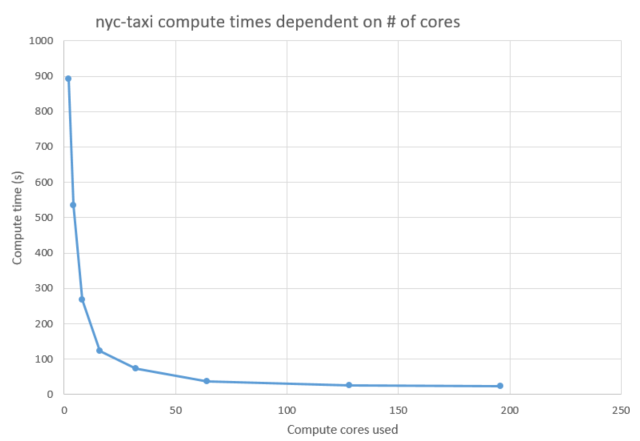
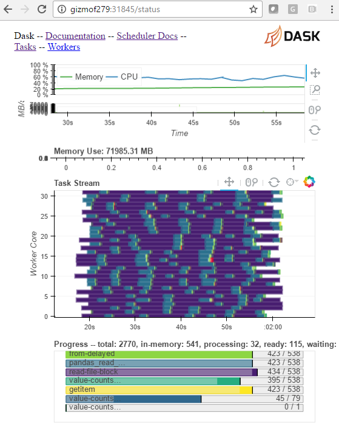

Dask Training
===

Prepare session 
---

go to https://github.com/FredHutch/sc-training and prepare for training:

          1. training-preparation
           


checkout github training repos
---

```
> git clone git://github.com/FredHutch/sc-training
> cd sc-training/dask
```


What is Dask ?
---

Dask is a compute framework that allows data scientists to use dataframes
or arrays that span multiple cpus or machines. 
These dataframe or array objects are (largely) compatible with pandas 
dataframes and numpy arrays.
Dask allows us to work on data that is too large to fit a single machine 
or use more cpus than you would typically find on a single machine. 


Testing Dask
---

First we are going to have a look at the code we want to execute. 

```
> head nyc-taxi.py
#! /usr/bin/env python3

import sys, os 
from distributed import Executor, progress
from dask import dataframe as dd

if len(sys.argv) < 2:
    e = Executor('127.0.0.1:8786')
else:
    e = Executor(sys.argv[1])
```

you can launch nyc-taxi.py with the ip address / host name / port of the 
dask scheduler that is able to receive the data. For example we can 
time the execution of this script that this submitted to a dask cluster
which runs ontop of gizmo.

```
petersen@rhino1:/home…-training/dask$ time ./nyc-taxi.py gizmof8:12922
<Client: scheduler="gizmof8:12922" processes=4 cores=8>
.
.
real	4m16.661s
user	0m3.703s
sys	0m0.552s

```

so this script runs a little longer than 4 minutes when using 4 workers
with a total of 8 cpu cores.


A Dask cluster on Gizmo (our HPC cluster running SLURM)
---

Now let's start a new Dask cluster using the 'grabdask' script. When the
script asks how many workers we want we answer 64.

```
petersen@rhino1:/home…-training/dask$ grabdask 

Please enter the number of dask workers (default: 8): 64
Please enter the number of days to grab these workers (default: 1): 
Job 45980892: 2 cores per worker, 128 total cores.
Job 45980892 pending, reason: None
Job 45980892 started, waiting for Dask...

  WARNING: Dask has been started in your user context, which means that:
  Anyone connecting to port gizmof77:16575 could get access to your data
  in mounted file systems such as /home or /fh

  You can now connect to Dask, e.g. e = distributed.Executor("gizmof77:16575").
  For status monitoring with Bokeh please go to http://gizmof77:16576/
  or wait until browser is started....

```

We see the the Dask executor (or scheduler) is now listening on 
gizmof77:16575 so we pass this information to the nyc-taxi.py script: 

```
petersen@rhino1:/home…-training/dask$ time ./nyc-taxi.py gizmof77:16575
<Client: scheduler="gizmof77:16575" processes=64 cores=128>
payment type:
1    137641498
2     76840558
3       773472
4       263929
5           34
Name: payment_type, dtype: int64

real	0m25.622s
user	0m3.114s
sys	0m0.412s

```

We see that this script now runs in 26 instead of 266 seconds. While we
achieve a 10 fold performance improvement we need 16 times more 
computer power.

Running the same test with 2, 4, 8, 16, 32, 64, 128 and 196 cores we get 
run times between 893 and 23 seconds:




We can see that while there a dramatic performance improvement after increasing 
the core count it may not be worth throwing more than 64 cores at this 
specific compute problem.


nyc-taxi.py - what does it actually do ?
--- 

```
    !python
    from dask import dataframe as dd
    nyc2 = dd.read_csv(testdata+'/nyc-taxi-cleaned/yellow2/*.csv',
            parse_dates=['tpep_pickup_datetime', 'tpep_dropoff_datetime'])

    nyc2 = e.persist(nyc2)

    print('payment type, please wait ...')
    print(nyc2.payment_type.value_counts().compute())
```

- We use the read_csv function we already know from pandas to load all
  csv files in a directory 
- the persist function tells the distrbuted executor that there is work
- and finally we are counting and grouping the occurrence of each payment
  type.
- the only difference from pandas is that .compute() needs to be called
  explicily to start the query or computation


Running in batch mode
---

The grabdask script is useful for building a Dask cluster and then 
trying a number of options on the same cluster. For production use 
this is not optimal because the dask cluster will keep running and block 
resources until manually stopped. We prefer batch mode instead and can 
use the fhdask script with sbatch:

```
> sbatch --tasks=32 --cpus-per-task=2 --time=1-0 fhdask ./nyc-taxi.py

```

Using batchmode has the following benefits:

- Gizmo ressources are only allocated for the time the dask script runs
- You do not have to remember the host and port of the Dask scheduler
  (the fhdask script passes host:port as 1st arg to the python script)
- The dask scheduler is shutdown quickly can not pose a potential security risk

one thing to consider with batch mode is that you need to check the output 
file *.dask.out for the hostname and port of the Bokeh web interface:

```
> grep BOKEH 46100942.dask.out 
BOKEH gizmof279:31845

```

With this information you can connect to http://gizmof279:31845/status
and see this:




Problems
---

Sometimes, when I am launching 16 workers, I am getting this error message. I am not
getting it with 4, 8, 32 or 64....weird:

```
petersen@rhino1:/home…-training/dask$ grabdask 
Please enter the number of dask workers (default: 8): 16
Please enter the number of days to grab these workers (default: 1): 
Job 45980375: 2 cores per worker, 32 total cores.
Job 45980375 pending, reason: None
Job 45980375 pending, reason: 
job ended and likely failed, please check 45980375.dask.err :
srun: error: Unable to create job step: More processors requested than permitted

```

References
---

https://www.continuum.io/blog/developer-blog/high-performance-hadoop-anaconda-and-dask-your-cluster
http://matthewrocklin.com/blog/work/2016/02/22/dask-distributed-part-2
https://github.com/dask/dask-examples/blob/master/nyctaxi-2013.ipynb
